### Introduction

1.

2.

3.

4.

5.

6.
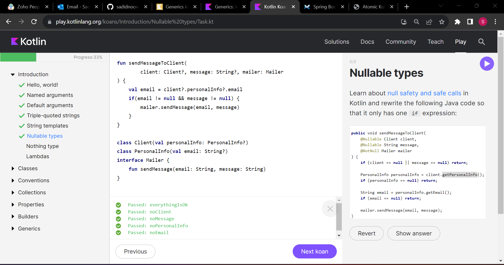

### Classes

1.

2.

4.

5.

### Conventions

2.

3.

5.

### Collections

1.
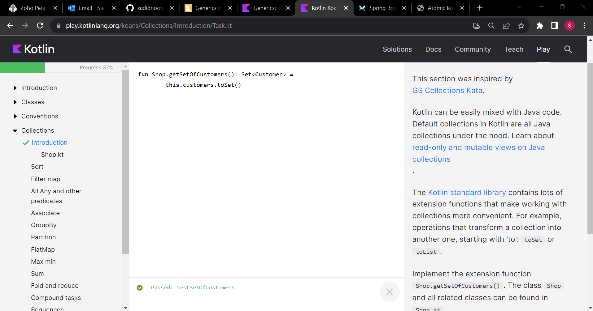

2.
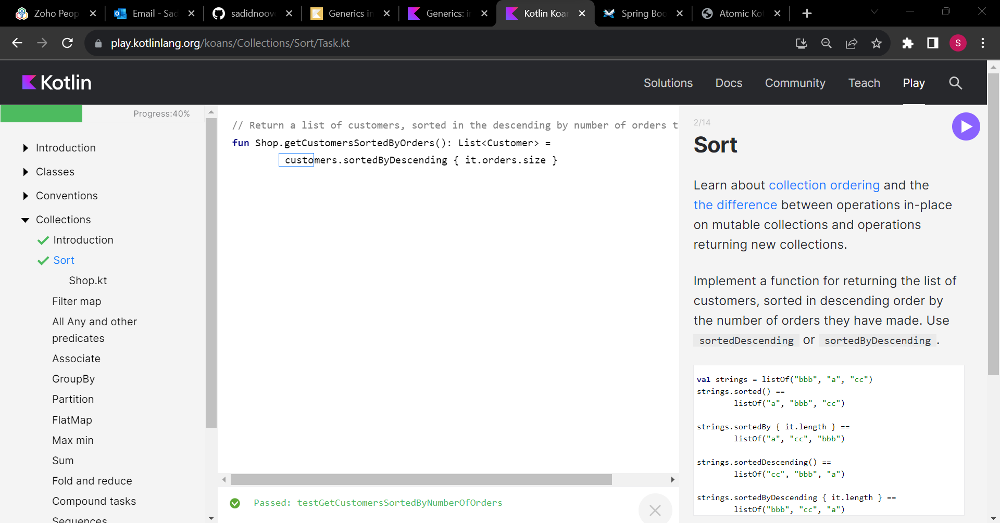

3.
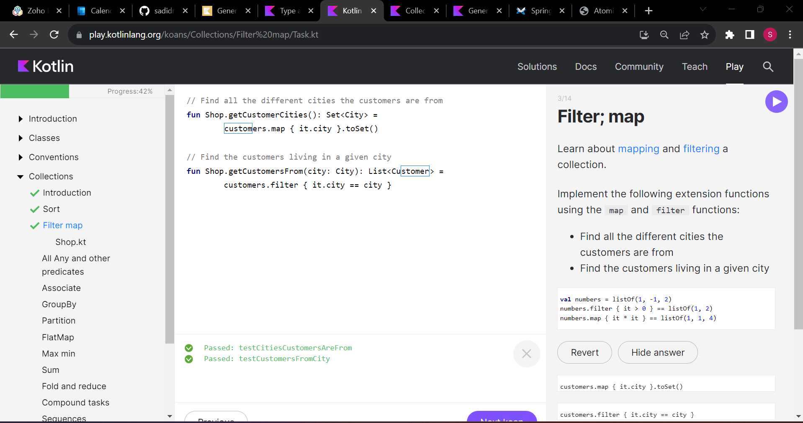

4.
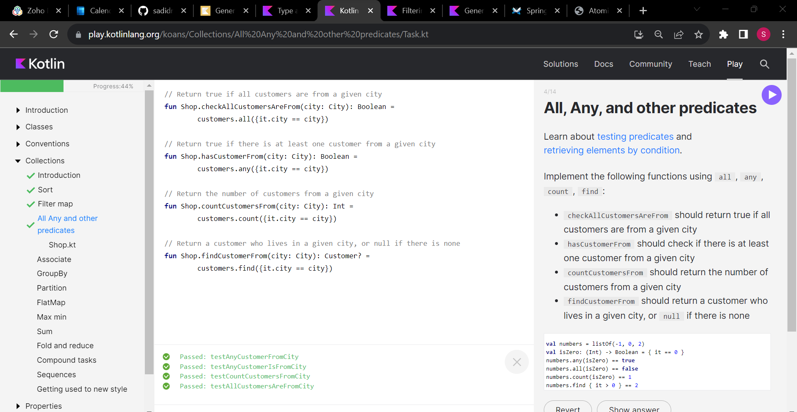

5.
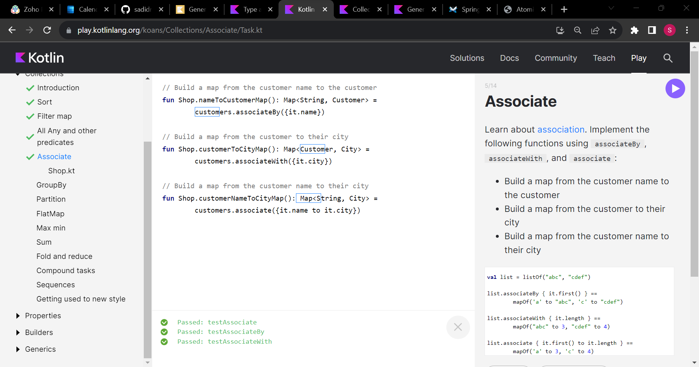

6.
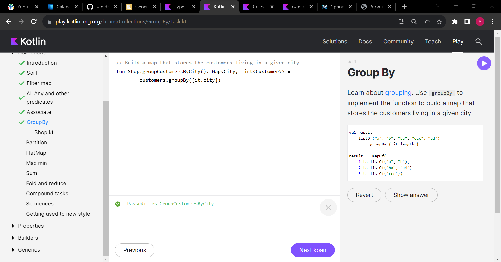

7.
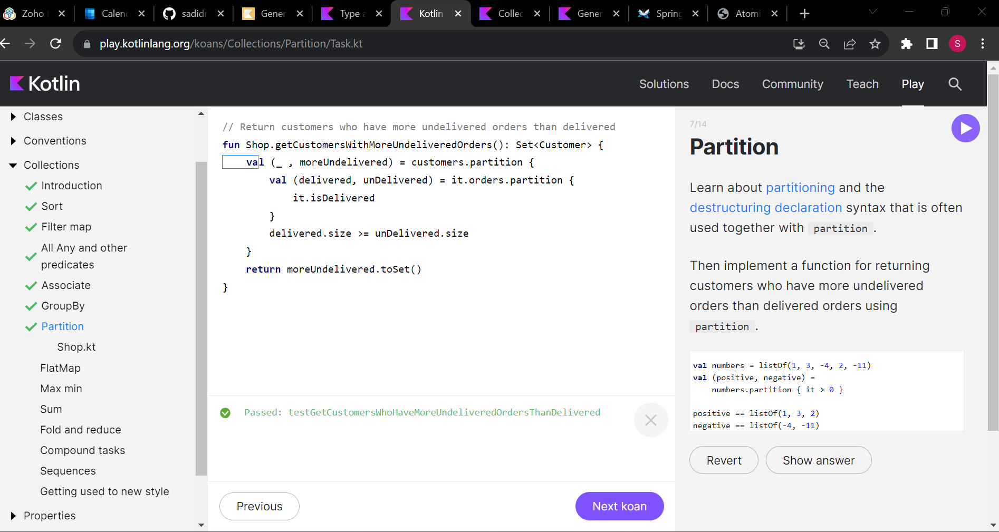

8.
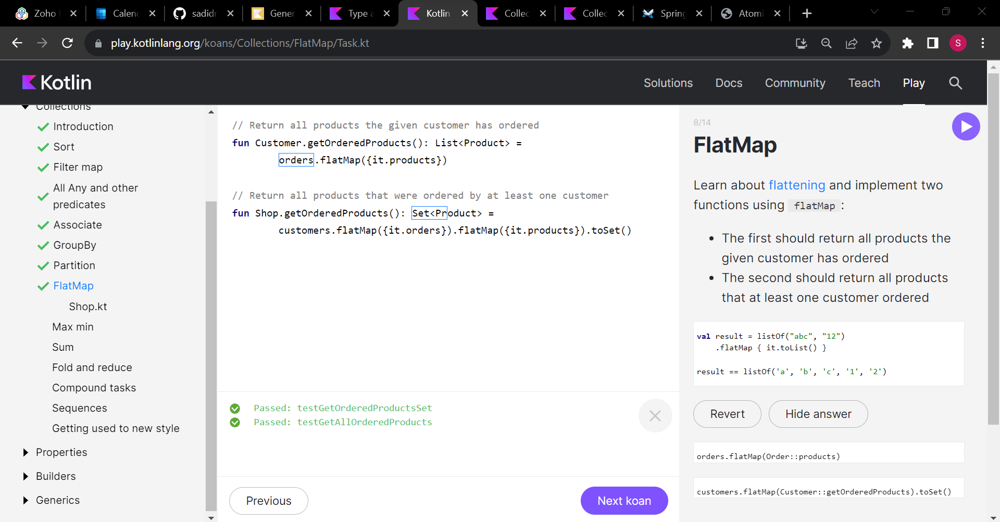

9.
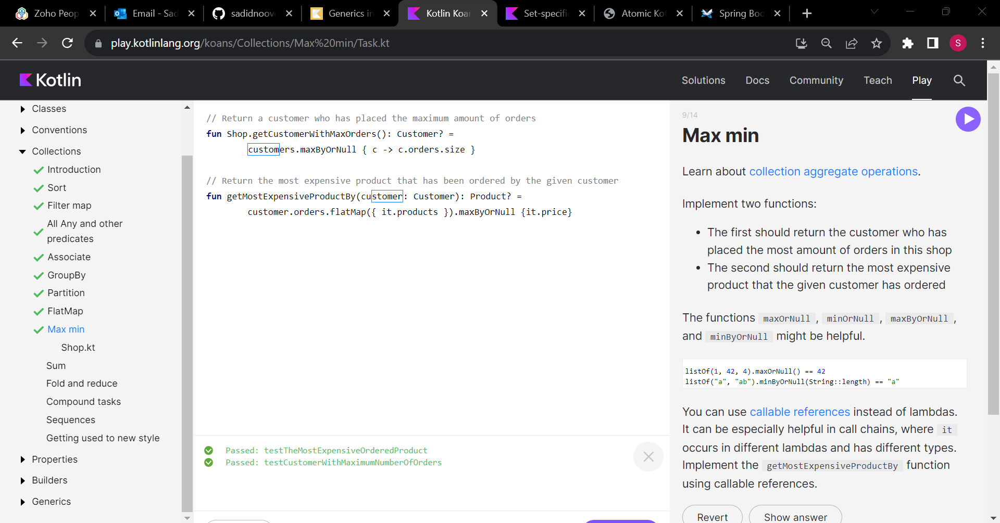

10.
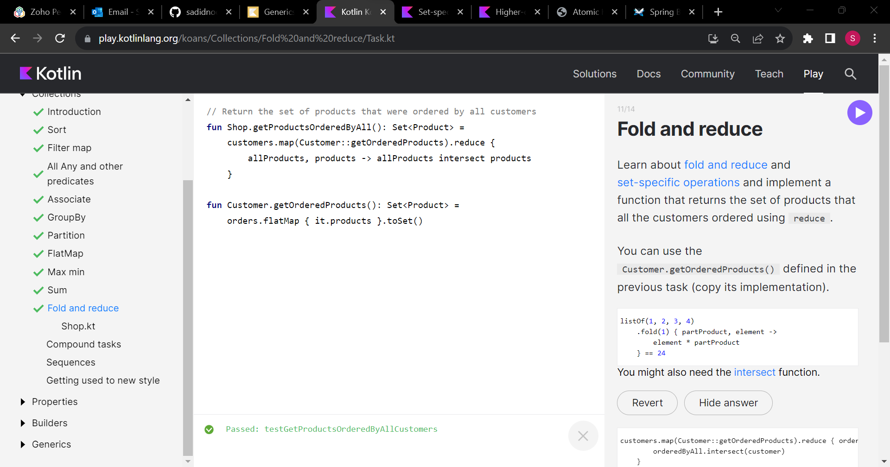

11.
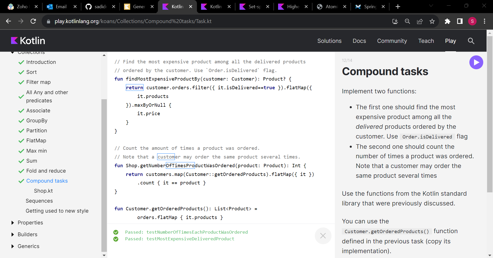

12.

### Properties

1.

### Generics

1.
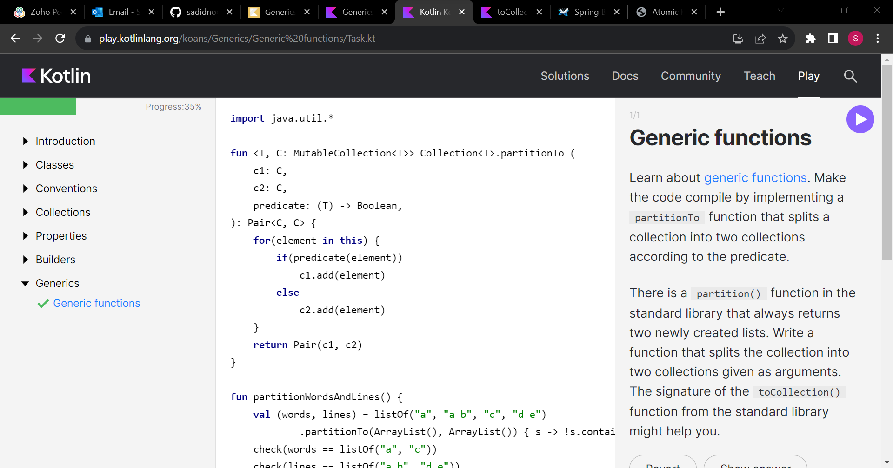