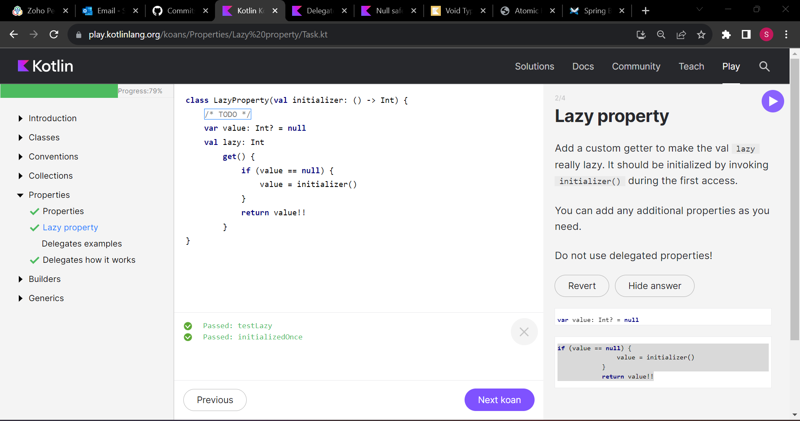

### Introduction

1.

2.

3.

4.

5.

6.

7.

### Classes

1.

2.

3.

4.

5.

### Conventions

1.

2.

3.

4.

5.

### Collections

1.

2.

3.

4.

5.

6.

7.

8.

9.

10.

11.

12.

13.

### Properties

1.

2.

3.

4.

### Generics

1.
